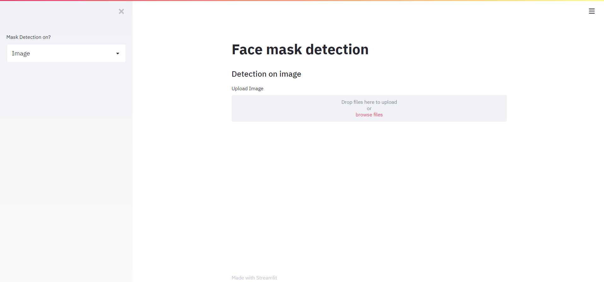

## 🚀 Installation
1. Clone the repo
```
$ git clone https://github.com/Meet0037/FaceMaskDetection-COVID19.git
```

2. Change your directory to the cloned repo and create a Python virtual environment named 'test'
```
$ mkvirtualenv test
```

3. Now, run the following command in your Terminal/Command Prompt to install the libraries required
```
$ pip3 install -r requirements.txt
```

## :bulb: Working

1. Open terminal. Go into the cloned project directory folder and type the following command:
```
$ python3 train_mask_detector.py --dataset dataset
```

2. To detect face masks in an image type the following command: 
```
$ python3 detect_mask_image.py --image images/pic1.jpeg
```

3. To detect face masks in real-time video streams type the following command:
```
$ python3 detect_mask_video.py 
```
## :key: Results

#### Our model gave 93% accuracy for Face Mask Detection after training via <code>tensorflow-gpu==2.0.0</code>


#### We got the following accuracy/loss training curve plot


## Streamlit app

Face Mask Detector webapp using Tensorflow & Streamlit

command
```
$ streamlit run app.py 
```
## Images

<p align="center">
  
</p>
<p align="center">Upload Images</p>

<p align="center">
  
</p>
<p align="center">Results</p>


In this tutorial, we’ll discuss our two-phase COVID-19 face mask detector, detailing how our computer vision/deep learning pipeline will be implemented.

From there, we’ll review the dataset we’ll be using to train our custom face mask detector.

I’ll then show you how to implement a Python script to train a face mask detector on our dataset using Keras and TensorFlow.

We’ll use this Python script to train a face mask detector and review the results.

Given the trained COVID-19 face mask detector, we’ll proceed to implement two more additional Python scripts used to:

  1.  Detect COVID-19 face masks in images
  2.  Detect face masks in real-time video streams
>>>>>>> 3c9d0edd53287951d10fcc63b12fb9b68c6de209
